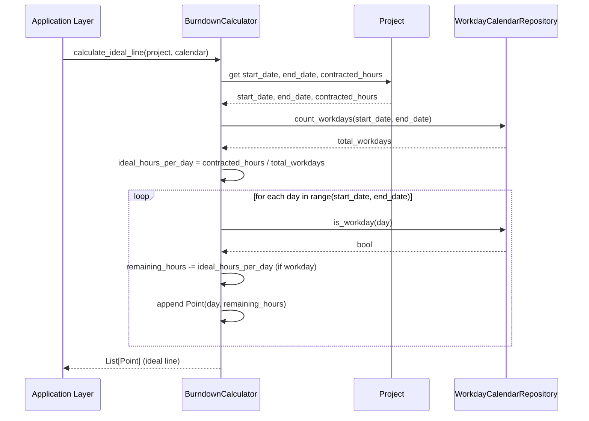
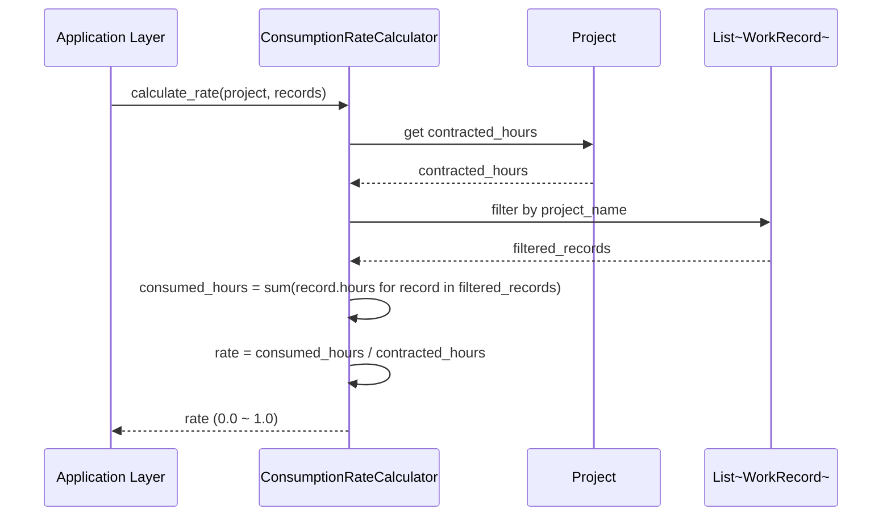

# Domain Layer Design

## 1. Overview（概要）

本ドキュメントは、Profit Trace の Domain 層の詳細設計を定義する。Domain 層は、工数消化状況の可視化に関するビジネスロジックを集約し、他の層（Application / Presentation / Infrastructure）から独立して実装される。

### 設計対象の目的
- 工数消化率計算、バーンダウン計算、営業日数計算、要因推定などのビジネスロジックを Domain 層に集約する
- エンティティ（Project, WorkRecord, WorkdayCalendar, Member）を定義し、ドメインモデルを構築する
- Repository インターフェースを Domain 層で定義し、Infrastructure 層への依存を排除する

### 関連する REQ-ID
- **機能要件**: REQ-F-001〜REQ-F-009（全機能要件）
- **非機能要件**: REQ-NF-004（保守性）、REQ-NF-008（テスト容易性）

### 関連する ADR
- ADR-001: DDD Lite Monolith アーキテクチャの採用
- ADR-004: Repository パターンによる層間依存性管理

---

## 2. Architecture Alignment（アーキテクチャ整合性）

### ADR-001 の要点と影響
- Domain 層にビジネスロジック（工数消化率計算、バーンダウン計算、営業日数計算、要因推定）を集約する
- エンティティは Project, WorkRecord, WorkdayCalendar, Member とする
- 過度な抽象化を避け、Aggregate Root や Value Object は最小限の使用とする
- Domain 層は Infrastructure 層に依存しない（依存性逆転の原則）

### ADR-004 の要点と影響
- Repository インターフェースを Domain 層で定義する
- Infrastructure 層で Repository インターフェースを実装する（ProjectRepository, WorkRecordRepository, WorkdayCalendarRepository, MemberRepository）
- Application 層は Repository インターフェース経由でのみデータにアクセスする
- Repository の実装は ORM を使用せず、生 SQL または pandas.read_sql で実装する

### 依存方向の制約
- **許可**: Domain 層 → なし（完全に独立）
- **禁止**: Domain 層 → Infrastructure 層（依存性逆転の原則により禁止）
- **禁止**: Domain 層 → Application 層（レイヤー依存ルール違反）
- **禁止**: Domain 層 → Presentation 層（レイヤー依存ルール違反）

### 02_system-requirements との整合性
- エンティティの定義は、02_system-requirements.md の「2. Definitions」に記載された用語定義と整合する
- ビジネスロジックは、REQ-F-005（バーンダウン計算）、REQ-F-007（要因推定）の要件を満たす
- Repository インターフェースは、REQ-F-001〜REQ-F-003（CSV/JSON インポート）、REQ-F-008（データ再読み込み）の要件に対応する

---

## 3. Design Details（詳細設計）

### 3.1 構造（Structure）

#### エンティティ一覧

| エンティティ名 | 責務 | 主要属性 |
|---------------|------|---------|
| Project | プロジェクト契約情報を管理する | project_id, name, start_date, end_date, contracted_hours |
| WorkRecord | 工数実績データを管理する | record_id, date, hours, member_name, project_name, memo |
| WorkdayCalendar | 営業日カレンダーを管理する | year_month, day, is_workday |
| Member | メンバー情報を管理する | member_name |

#### Repository インターフェース一覧

| Repository名 | 責務 | 主要メソッド |
|-------------|------|------------|
| ProjectRepository | Project エンティティの永続化 | find_all(), find_by_name(name), save(project), delete_all() |
| WorkRecordRepository | WorkRecord エンティティの永続化 | find_all(), find_by_project(project_name), find_by_member(member_name), find_by_date_range(start, end), save_bulk(records), delete_all() |
| WorkdayCalendarRepository | WorkdayCalendar エンティティの永続化 | find_all(), find_by_year_month(year_month), is_workday(date), save_bulk(calendars), delete_all() |
| MemberRepository | Member エンティティの永続化 | find_all(), find_by_name(name), save(member), delete_all() |

#### ドメインサービス一覧

| サービス名 | 責務 | 主要メソッド |
|----------|------|------------|
| BurndownCalculator | バーンダウンチャートの理想線・実績線を計算する | calculate_ideal_line(project, workday_calendar), calculate_actual_line(project, work_records, workday_calendar) |
| ConsumptionRateCalculator | 工数消化率を計算する | calculate_rate(project, work_records) |
| WorkloadAnalyzer | メンバー別稼働状況を分析する | analyze_member_workload(member_name, work_records, workday_calendar) |
| FactorEstimator | 工数余剰要因を推定する | estimate_factors(project, work_records, workday_calendar) |

#### クラス構成図

```mermaid
classDiagram
    class Project {
        +str project_id
        +str name
        +date start_date
        +date end_date
        +float contracted_hours
        +calculate_remaining_hours(consumed_hours: float) float
        +is_active(current_date: date) bool
    }

    class WorkRecord {
        +str record_id
        +date date
        +float hours
        +str member_name
        +str project_name
        +str memo
    }

    class WorkdayCalendar {
        +str year_month
        +int day
        +bool is_workday
    }

    class Member {
        +str member_name
    }

    class ProjectRepository {
        <<interface>>
        +find_all() List~Project~
        +find_by_name(name: str) Project
        +save(project: Project) void
        +delete_all() void
    }

    class WorkRecordRepository {
        <<interface>>
        +find_all() List~WorkRecord~
        +find_by_project(project_name: str) List~WorkRecord~
        +find_by_member(member_name: str) List~WorkRecord~
        +find_by_date_range(start: date, end: date) List~WorkRecord~
        +save_bulk(records: List~WorkRecord~) void
        +delete_all() void
    }

    class WorkdayCalendarRepository {
        <<interface>>
        +find_all() List~WorkdayCalendar~
        +find_by_year_month(year_month: str) List~WorkdayCalendar~
        +is_workday(date: date) bool
        +save_bulk(calendars: List~WorkdayCalendar~) void
        +delete_all() void
    }

    class MemberRepository {
        <<interface>>
        +find_all() List~Member~
        +find_by_name(name: str) Member
        +save(member: Member) void
        +delete_all() void
    }

    class BurndownCalculator {
        +calculate_ideal_line(project: Project, calendar: WorkdayCalendarRepository) List~Point~
        +calculate_actual_line(project: Project, records: List~WorkRecord~, calendar: WorkdayCalendarRepository) List~Point~
    }

    class ConsumptionRateCalculator {
        +calculate_rate(project: Project, records: List~WorkRecord~) float
    }

    class WorkloadAnalyzer {
        +analyze_member_workload(member_name: str, records: List~WorkRecord~, calendar: WorkdayCalendarRepository) WorkloadAnalysis
    }

    class FactorEstimator {
        +estimate_factors(project: Project, records: List~WorkRecord~, calendar: WorkdayCalendarRepository) List~Factor~
    }

    BurndownCalculator ..> Project
    BurndownCalculator ..> WorkRecord
    BurndownCalculator ..> WorkdayCalendarRepository
    ConsumptionRateCalculator ..> Project
    ConsumptionRateCalculator ..> WorkRecord
    WorkloadAnalyzer ..> WorkRecord
    WorkloadAnalyzer ..> WorkdayCalendarRepository
    FactorEstimator ..> Project
    FactorEstimator ..> WorkRecord
    FactorEstimator ..> WorkdayCalendarRepository
```



### 3.2 データフロー

#### エンティティの生成フロー
1. **CSV/JSON インポート時**: Infrastructure 層が CSV/JSON を読み込み、エンティティを生成する
2. **バリデーション**: Application 層がエンティティのバリデーションを行う
3. **永続化**: Infrastructure 層が Repository 実装経由で SQLite に保存する
4. **取得**: Application 層が Repository インターフェース経由でエンティティを取得する
5. **ビジネスロジック実行**: Domain 層のドメインサービスがエンティティを使用してビジネスロジックを実行する

#### ドメインサービスの実行フロー
1. **Application 層がドメインサービスを呼び出す**: 例: `BurndownCalculator.calculate_ideal_line(project, calendar)`
2. **ドメインサービスが Repository インターフェース経由でデータを取得する**: 例: `calendar.is_workday(date)`
3. **ドメインサービスがビジネスロジックを実行する**: 例: 営業日数を計算し、理想線を算出する
4. **ドメインサービスが結果を返却する**: 例: `List[Point]`（理想線のデータポイント）

### 3.3 振る舞い（Behavior）

#### ユースケース: バーンダウンチャートの理想線計算



#### ユースケース: 工数消化率計算



#### 例外処理方針
- **バリデーションエラー**: エンティティ生成時に属性の妥当性をチェックし、不正な値の場合は `ValueError` を発生させる
- **データ不整合エラー**: Repository からデータが取得できない場合は `DataNotFoundError` を発生させる
- **計算エラー**: ビジネスロジック実行時にゼロ除算などのエラーが発生した場合は `CalculationError` を発生させる

#### エラー時の振る舞い
- Domain 層で発生した例外は、Application 層でキャッチし、適切なエラーメッセージを Presentation 層に返却する
- Domain 層は例外を握りつぶさず、必ず上位層に伝播させる
- ログ出力は Application 層または Infrastructure 層で行い、Domain 層ではログ出力を行わない（Domain 層の独立性を保つため）

---

## 4. Mapping to Requirements（要件への対応）

| 設計要素 | 対応する REQ | 説明 |
|---------|--------------|-------|
| Project | REQ-F-001 | プロジェクト契約情報の CSV インポート |
| WorkRecord | REQ-F-002 | 工数実績データの CSV インポート |
| WorkdayCalendar | REQ-F-003 | 休日マスタの JSON インポート |
| Member | REQ-F-006 | 個人ごとの稼働状況可視化 |
| BurndownCalculator | REQ-F-005 | バーンダウンチャート形式での工数消化可視化 |
| ConsumptionRateCalculator | REQ-F-004 | プロジェクト一覧画面の消化率表示 |
| WorkloadAnalyzer | REQ-F-006 | 個人ごとの稼働状況可視化 |
| FactorEstimator | REQ-F-007 | 工数余剰要因の分析支援 |
| ProjectRepository | REQ-F-001, REQ-F-008 | プロジェクト契約情報のインポート・再読み込み |
| WorkRecordRepository | REQ-F-002, REQ-F-008 | 工数実績データのインポート・再読み込み |
| WorkdayCalendarRepository | REQ-F-003, REQ-F-008 | 休日マスタのインポート・再読み込み |
| MemberRepository | REQ-F-006 | メンバー情報の管理 |

### 未対応の REQ
- **REQ-F-009（レポート機能）**: Application 層で実装（Domain 層のドメインサービスを組み合わせてレポートデータを生成）
- **REQ-NF-001〜REQ-NF-003, REQ-NF-005〜REQ-NF-007**: Infrastructure 層および Presentation 層で実装

---

## 5. Trade-offs（設計上の判断）

### 判断 1: エンティティの粒度（Aggregate Root を使用しない）
- **選択肢 A**: Project を Aggregate Root とし、WorkRecord を Project の子エンティティとする
- **選択肢 B**: Project と WorkRecord を独立したエンティティとし、Aggregate Root を使用しない
- **採用**: 選択肢 B
- **理由**: 本プロジェクトは読み取り中心であり、エンティティ間の整合性制約が少ない。Aggregate Root を使用すると過度な抽象化になり、実装コストが増加する。ADR-001 の「過度な抽象化を避ける」方針に沿って、選択肢 B を採用する。

### 判断 2: Value Object の使用（最小限に抑える）
- **選択肢 A**: Date, Hours, ProjectName などを Value Object として定義する
- **選択肢 B**: Python の標準型（date, float, str）を使用する
- **採用**: 選択肢 B
- **理由**: Value Object を使用すると、型変換のコストが増加し、実装が煩雑になる。小規模チーム（1〜3名）では、Python の標準型を使用することで実装効率を維持する。ADR-001 の「Value Object は最小限の使用」方針に沿って、選択肢 B を採用する。

### 判断 3: Repository の粒度（エンティティ単位）
- **選択肢 A**: エンティティ単位で Repository を作成する（ProjectRepository, WorkRecordRepository 等）
- **選択肢 B**: 集約単位で Repository を作成する（ProjectAggregateRepository 等）
- **採用**: 選択肢 A
- **理由**: ADR-004 の「エンティティ単位で Repository を作成し、複雑なクエリは専用メソッドを追加」方針に沿って、選択肢 A を採用する。集約単位では Repository の責務が不明確になり、保守性が低下する。

---

## 6. Risks & Future Considerations（リスクと将来拡張）

### リスク 1: Domain 層へのビジネスロジックの集約不足
- **リスク**: Application 層や Presentation 層にビジネスロジックが漏れる可能性がある
- **影響**: ビジネスロジックの重複・分散により、保守性が低下する
- **軽減策**: コーディング規約で「Domain 層以外にビジネスロジックを書かない」ルールを明文化し、コードレビューで確認する。月次アーキテクチャレビューで Domain 層の責務を確認する。

### リスク 2: Repository インターフェースの肥大化
- **リスク**: Repository に集計クエリや複雑な検索条件が増加し、実装が肥大化する可能性がある
- **影響**: Repository の保守性が低下し、テストが困難になる
- **軽減策**: Repository は CRUD 操作と基本的な検索クエリのみに責務を限定し、複雑な集計処理はドメインサービスに委譲する。Repository インターフェースにパフォーマンス要件をコメントで明記する。

### リスク 3: エンティティの属性検証不足
- **リスク**: エンティティ生成時に属性の妥当性検証が不足し、不正なデータが永続化される可能性がある
- **影響**: データ不整合により、ビジネスロジックが正常に動作しない
- **軽減策**: エンティティのコンストラクタで属性の妥当性検証を行い、不正な値の場合は `ValueError` を発生させる。単体テストでバリデーションロジックを網羅的にテストする。

### 将来の変更時に影響が出る箇所
- **新しいエンティティの追加**: Project / WorkRecord / WorkdayCalendar / Member 以外のエンティティが必要になった場合、対応する Repository インターフェースとドメインサービスを追加する必要がある
- **複雑な要因推定ロジックの追加**: 機械学習モデルを使用する場合、FactorEstimator の実装を変更する必要がある。ただし、Repository インターフェース経由でデータを取得するため、Domain 層の他の部分への影響は最小限に抑えられる。
- **外部サービス連携**: CSV/JSON 以外のデータソース（API 連携等）が追加された場合、Repository の実装を変更する必要があるが、Repository インターフェースは変更不要である。

### ADR を再評価するべきトリガー
- **トリガー 1**: エンティティ間の整合性制約が複雑化し、Aggregate Root の導入が必要になった場合
- **トリガー 2**: Value Object の導入により型安全性が大幅に向上すると判断された場合
- **トリガー 3**: Repository の実装が肥大化し、CQRS（読み取り/書き込み分離）の導入が必要になった場合

---

## 7. Appendix

### エンティティの詳細仕様

#### Project エンティティ
```python
@dataclass
class Project:
    project_id: str
    name: str
    start_date: date
    end_date: date
    contracted_hours: float

    def __post_init__(self):
        if self.contracted_hours <= 0:
            raise ValueError("contracted_hours must be positive")
        if self.start_date >= self.end_date:
            raise ValueError("start_date must be before end_date")

    def calculate_remaining_hours(self, consumed_hours: float) -> float:
        """残工数を計算する"""
        return self.contracted_hours - consumed_hours

    def is_active(self, current_date: date) -> bool:
        """プロジェクトが稼働中かどうかを判定する"""
        return self.start_date <= current_date <= self.end_date
```

#### WorkRecord エンティティ
```python
@dataclass
class WorkRecord:
    record_id: str
    date: date
    hours: float
    member_name: str
    project_name: str
    memo: str = ""

    def __post_init__(self):
        if self.hours < 0:
            raise ValueError("hours must be non-negative")
        if not self.member_name:
            raise ValueError("member_name must not be empty")
        if not self.project_name:
            raise ValueError("project_name must not be empty")
```

#### WorkdayCalendar エンティティ
```python
@dataclass
class WorkdayCalendar:
    year_month: str  # "YYYY-MM" format
    day: int  # 1-31
    is_workday: bool

    def __post_init__(self):
        if not re.match(r"^\d{4}-(0[1-9]|1[0-2])$", self.year_month):
            raise ValueError("year_month must be in YYYY-MM format")
        if not 1 <= self.day <= 31:
            raise ValueError("day must be between 1 and 31")
```

#### Member エンティティ
```python
@dataclass
class Member:
    member_name: str

    def __post_init__(self):
        if not self.member_name:
            raise ValueError("member_name must not be empty")
```

### Repository インターフェースの詳細仕様

#### ProjectRepository インターフェース
```python
from abc import ABC, abstractmethod
from typing import List, Optional

class ProjectRepository(ABC):
    @abstractmethod
    def find_all(self) -> List[Project]:
        """全プロジェクトを取得する"""
        pass

    @abstractmethod
    def find_by_name(self, name: str) -> Optional[Project]:
        """プロジェクト名で検索する"""
        pass

    @abstractmethod
    def save(self, project: Project) -> None:
        """プロジェクトを保存する"""
        pass

    @abstractmethod
    def delete_all(self) -> None:
        """全プロジェクトを削除する（再インポート時に使用）"""
        pass
```

### ドメインサービスの詳細仕様

#### BurndownCalculator の詳細仕様
```python
@dataclass
class Point:
    date: date
    remaining_hours: float

class BurndownCalculator:
    def calculate_ideal_line(
        self,
        project: Project,
        calendar: WorkdayCalendarRepository
    ) -> List[Point]:
        """理想線を計算する

        Args:
            project: プロジェクト情報
            calendar: 営業日カレンダー

        Returns:
            理想線のデータポイントリスト
        """
        workdays = calendar.count_workdays(project.start_date, project.end_date)
        if workdays == 0:
            raise CalculationError("No workdays found in project period")

        ideal_hours_per_day = project.contracted_hours / workdays
        remaining_hours = project.contracted_hours
        points = []

        current_date = project.start_date
        while current_date <= project.end_date:
            if calendar.is_workday(current_date):
                remaining_hours -= ideal_hours_per_day
            points.append(Point(current_date, remaining_hours))
            current_date += timedelta(days=1)

        return points
```

### メモ・補足
- Domain 層の実装は、Python 3.12 の型ヒント（Type Hints）を活用し、型安全性を向上させる
- エンティティは `dataclass` を使用して定義し、実装コストを削減する
- Repository インターフェースは `abc.ABC` を継承し、抽象メソッドとして定義する
- ドメインサービスは、複雑なビジネスロジックをエンティティから分離するために使用する
