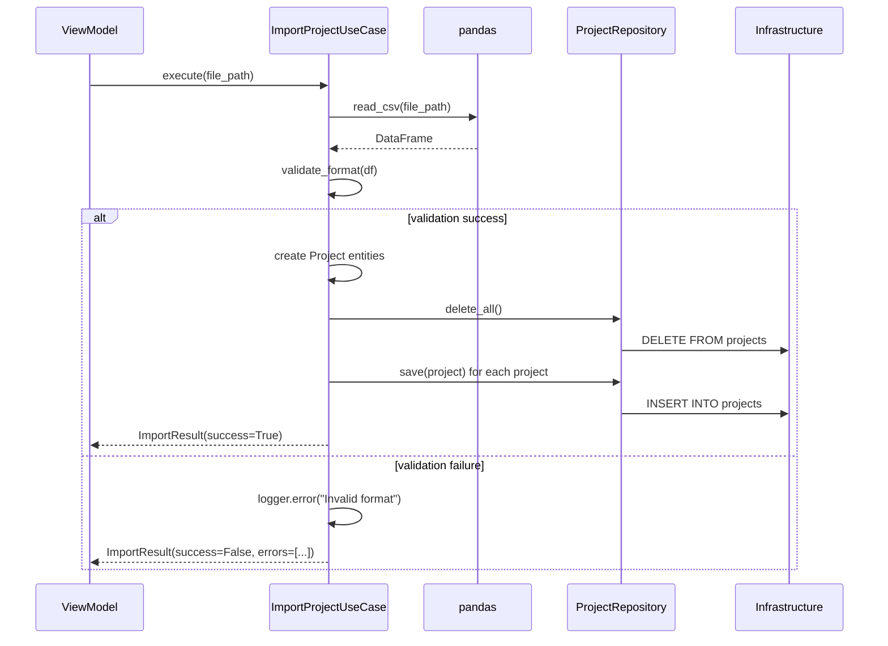
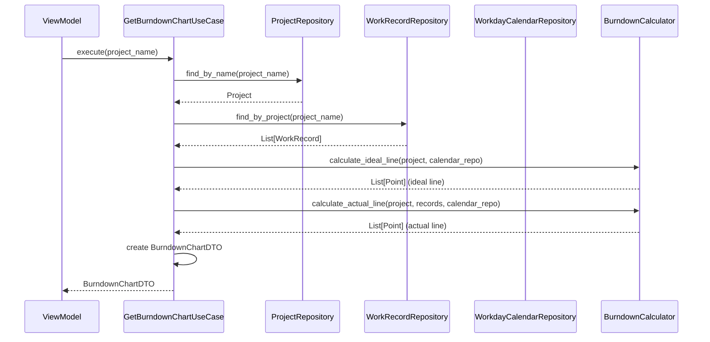

# Application Layer Design

## 1. Overview（概要）

本ドキュメントは、Profit Trace の Application 層の詳細設計を定義する。Application 層は、ユースケース（CSV/JSON インポート、プロジェクト一覧取得、バーンダウンチャート生成等）を実装し、Presentation 層と Domain 層の橋渡しを行う。

### 設計対象の目的
- ユースケースの調整（Domain 層のビジネスロジックを呼び出し、Infrastructure 層でデータを永続化）
- CSV/JSON インポート処理のバリデーションとエラーハンドリング
- DTO（Data Transfer Object）による Presentation 層とのデータ交換

### 関連する REQ-ID
- **機能要件**: REQ-F-001〜REQ-F-009（全機能要件）
- **非機能要件**: REQ-NF-001〜REQ-NF-002（パフォーマンス）、REQ-NF-004（保守性）、REQ-NF-005（ログ記録）

### 関連する ADR
- ADR-001: DDD Lite Monolith アーキテクチャの採用
- ADR-003: SQLite キャッシュ方式によるデータストア戦略
- ADR-004: Repository パターンによる層間依存性管理

---

## 2. Architecture Alignment（アーキテクチャ整合性）

### ADR-001 の要点と影響
- Application 層はユースケース実装を担当し、Domain 層と Infrastructure 層の橋渡しを行う
- Application 層は Domain 層のビジネスロジックを呼び出し、Infrastructure 層で永続化する
- Application 層はビジネスロジックを持たず、Domain 層に委譲する

### ADR-003 の要点と影響
- CSV/JSON ファイルを Single Source of Truth とし、SQLite をキャッシュとして扱う
- 日次で CSV/JSON を再取り込みし、SQLite を上書き更新する
- データの整合性は CSV データで上書きすることで保証する

### ADR-004 の要点と影響
- Application 層は Repository インターフェース経由でのみデータにアクセスする
- Application 層は Repository の実装詳細（SQLite の SQL クエリ等）に依存しない

### 依存方向の制約
- **許可**: Application 層 → Domain 層（ビジネスロジック呼び出し）
- **許可**: Application 層 → Infrastructure 層（Repository インターフェース経由）
- **禁止**: Application 層 → Presentation 層（レイヤー依存ルール違反）
- **禁止**: Application 層 → Infrastructure 層の実装詳細（Repository インターフェース経由のみ許可）

### 02_system-requirements との整合性
- ユースケースは、REQ-F-001〜REQ-F-009 の機能要件を満たす
- パフォーマンス要件（REQ-NF-001〜REQ-NF-002）を満たすために、pandas による一括処理を活用する
- エラーログの記録（REQ-NF-005）を Application 層で実装する

---

## 3. Design Details（詳細設計）

### 3.1 構造（Structure）

#### ユースケース一覧

| ユースケース名 | 責務 | 主要メソッド |
|--------------|------|------------|
| ImportProjectUseCase | プロジェクト契約情報の CSV インポート | execute(file_path: str) |
| ImportWorkRecordUseCase | 工数実績データの CSV インポート | execute(file_path: str) |
| ImportWorkdayCalendarUseCase | 休日マスタの JSON インポート | execute(file_path: str) |
| GetProjectListUseCase | プロジェクト一覧の取得 | execute() |
| GetBurndownChartUseCase | バーンダウンチャートデータの取得 | execute(project_name: str) |
| GetMemberWorkloadUseCase | メンバー別稼働状況の取得 | execute(member_name: str) |
| GetFactorAnalysisUseCase | 工数余剰要因の分析 | execute(project_name: str) |
| GenerateReportUseCase | レポートデータの生成 | execute() |
| ExportDataUseCase | データのエクスポート | execute(export_format: str) |

#### DTO（Data Transfer Object）一覧

| DTO名 | 責務 | 主要属性 |
|------|------|---------|
| ProjectDTO | プロジェクト情報を Presentation 層に渡す | name, start_date, end_date, contracted_hours, consumed_hours, consumption_rate, status |
| BurndownChartDTO | バーンダウンチャートデータを Presentation 層に渡す | project_name, ideal_line, actual_line, current_date_marker |
| MemberWorkloadDTO | メンバー別稼働状況を Presentation 層に渡す | member_name, total_hours, project_distribution, idle_periods |
| FactorAnalysisDTO | 工数余剰要因を Presentation 層に渡す | project_name, factors, confidence_level |
| ReportDTO | レポートデータを Presentation 層に渡す | projects, members, summary |

#### クラス構成図

```mermaid
classDiagram
    class ImportProjectUseCase {
        -ProjectRepository project_repo
        -logger Logger
        +execute(file_path: str) ImportResult
    }

    class ImportWorkRecordUseCase {
        -WorkRecordRepository work_record_repo
        -MemberRepository member_repo
        -logger Logger
        +execute(file_path: str) ImportResult
    }

    class ImportWorkdayCalendarUseCase {
        -WorkdayCalendarRepository calendar_repo
        -logger Logger
        +execute(file_path: str) ImportResult
    }

    class GetProjectListUseCase {
        -ProjectRepository project_repo
        -WorkRecordRepository work_record_repo
        -ConsumptionRateCalculator calc
        +execute() List~ProjectDTO~
    }

    class GetBurndownChartUseCase {
        -ProjectRepository project_repo
        -WorkRecordRepository work_record_repo
        -WorkdayCalendarRepository calendar_repo
        -BurndownCalculator calc
        +execute(project_name: str) BurndownChartDTO
    }

    class GetMemberWorkloadUseCase {
        -WorkRecordRepository work_record_repo
        -WorkdayCalendarRepository calendar_repo
        -WorkloadAnalyzer analyzer
        +execute(member_name: str) MemberWorkloadDTO
    }

    class GetFactorAnalysisUseCase {
        -ProjectRepository project_repo
        -WorkRecordRepository work_record_repo
        -WorkdayCalendarRepository calendar_repo
        -FactorEstimator estimator
        +execute(project_name: str) FactorAnalysisDTO
    }

    class GenerateReportUseCase {
        -ProjectRepository project_repo
        -WorkRecordRepository work_record_repo
        -MemberRepository member_repo
        -ConsumptionRateCalculator calc
        -WorkloadAnalyzer analyzer
        +execute() ReportDTO
    }

    class ProjectDTO {
        +str name
        +date start_date
        +date end_date
        +float contracted_hours
        +float consumed_hours
        +float consumption_rate
        +str status
    }

    class BurndownChartDTO {
        +str project_name
        +List~Point~ ideal_line
        +List~Point~ actual_line
        +date current_date_marker
    }

    ImportProjectUseCase ..> ProjectRepository
    ImportWorkRecordUseCase ..> WorkRecordRepository
    ImportWorkdayCalendarUseCase ..> WorkdayCalendarRepository
    GetProjectListUseCase ..> ProjectRepository
    GetProjectListUseCase ..> ConsumptionRateCalculator
    GetProjectListUseCase ..> ProjectDTO
    GetBurndownChartUseCase ..> BurndownCalculator
    GetBurndownChartUseCase ..> BurndownChartDTO
```



### 3.2 データフロー

#### CSV インポートのデータフロー
1. **Presentation 層**: ユーザーが CSV ファイルを選択し、ViewModel が ImportProjectUseCase を呼び出す
2. **Application 層**: ImportProjectUseCase が CSV ファイルを pandas で読み込む
3. **Application 層**: CSV データをバリデーション（フォーマットチェック、必須項目チェック）
4. **Application 層**: バリデーション通過後、Project エンティティを生成
5. **Application 層**: Repository 経由で既存データを削除（delete_all）
6. **Application 層**: Repository 経由で新しいデータを保存（save）
7. **Infrastructure 層**: Repository 実装が SQLite にデータを書き込む
8. **Application 層**: ImportResult（成功/失敗、エラーメッセージ）を Presentation 層に返却

#### バーンダウンチャート取得のデータフロー
1. **Presentation 層**: ViewModel が GetBurndownChartUseCase を呼び出す
2. **Application 層**: GetBurndownChartUseCase が Repository 経由でプロジェクト情報を取得
3. **Application 層**: Repository 経由で工数実績データと営業日カレンダーを取得
4. **Application 層**: BurndownCalculator（Domain 層）を呼び出して理想線・実績線を計算
5. **Application 層**: 計算結果を BurndownChartDTO に変換
6. **Application 層**: BurndownChartDTO を Presentation 層に返却

### 3.3 振る舞い（Behavior）

#### ユースケース: プロジェクト契約情報の CSV インポート



#### ユースケース: バーンダウンチャートデータの取得



#### 例外処理方針
- **ファイル読み込みエラー**: CSV/JSON ファイルが存在しない、または読み込めない場合は `FileNotFoundError` をキャッチし、ImportResult に失敗ステータスとエラーメッセージを設定
- **バリデーションエラー**: フォーマット不正、必須項目欠落等の場合は、エラー内容を ImportResult に記録し、ログに出力
- **データ不整合エラー**: Repository からデータが取得できない場合は `DataNotFoundError` をキャッチし、Presentation 層にエラーメッセージを返却
- **計算エラー**: Domain 層で `CalculationError` が発生した場合は、ログに出力し、Presentation 層にエラーメッセージを返却

#### エラー時の振る舞い
- Application 層で発生した例外は、すべてキャッチし、ログに記録する
- ユーザーに表示するエラーメッセージは、技術的詳細を含めず、問題の内容と対処方法を明確に記述する
- エラー発生時でもアプリケーションはクラッシュせず、正常復帰する（REQ-NF-008）

---

## 4. Mapping to Requirements（要件への対応）

| 設計要素 | 対応する REQ | 説明 |
|---------|--------------|-------|
| ImportProjectUseCase | REQ-F-001, REQ-F-008 | プロジェクト契約情報の CSV インポート・再読み込み |
| ImportWorkRecordUseCase | REQ-F-002, REQ-F-008 | 工数実績データの CSV インポート・再読み込み |
| ImportWorkdayCalendarUseCase | REQ-F-003, REQ-F-008 | 休日マスタの JSON インポート・再読み込み |
| GetProjectListUseCase | REQ-F-004 | プロジェクト一覧画面の表示 |
| GetBurndownChartUseCase | REQ-F-005 | バーンダウンチャート形式での工数消化可視化 |
| GetMemberWorkloadUseCase | REQ-F-006 | 個人ごとの稼働状況可視化 |
| GetFactorAnalysisUseCase | REQ-F-007 | 工数余剰要因の分析支援 |
| GenerateReportUseCase | REQ-F-009 | レポート機能（グラフと数値） |
| ExportDataUseCase | REQ-NF-006 | データバックアップ |
| ログ出力機能 | REQ-NF-005 | エラーログの記録 |
| pandas 一括処理 | REQ-NF-001 | データ読み込み時間の最適化 |

### 未対応の REQ
- **REQ-NF-003（操作性）**: Presentation 層で実装（ドラッグ&ドロップ、エラーダイアログ）
- **REQ-NF-007（セキュリティ）**: Infrastructure 層で実装（外部サーバーへの通信なし）

---

## 5. Trade-offs（設計上の判断）

### 判断 1: DTO の使用（Presentation 層とのデータ交換）
- **選択肢 A**: Domain エンティティを直接 Presentation 層に渡す
- **選択肢 B**: DTO（Data Transfer Object）を使用して Presentation 層にデータを渡す
- **採用**: 選択肢 B
- **理由**: Domain エンティティを直接 Presentation 層に渡すと、Presentation 層が Domain 層の実装詳細に依存し、変更影響範囲が拡大する。DTO を使用することで、Presentation 層と Domain 層を分離し、変更容易性を向上させる。

### 判断 2: バリデーションの実装場所（Application 層）
- **選択肢 A**: Domain 層でバリデーションを実装する（エンティティのコンストラクタ）
- **選択肢 B**: Application 層でバリデーションを実装する（ユースケース内）
- **採用**: 選択肢 A + 選択肢 B（両方）
- **理由**: エンティティの属性検証は Domain 層で実装し、CSV フォーマットのバリデーションは Application 層で実装する。これにより、Domain 層は CSV の構造に依存せず、Application 層は CSV インポートの責務を担う。

### 判断 3: pandas の使用（一括処理によるパフォーマンス最適化）
- **選択肢 A**: CSV を 1 行ずつ読み込み、エンティティを生成する
- **選択肢 B**: pandas で CSV を一括読み込みし、DataFrame を使用してバリデーション・エンティティ生成を行う
- **採用**: 選択肢 B
- **理由**: パフォーマンス要件（REQ-NF-001: CSV 読み込み 5〜10 秒）を満たすために、pandas の一括処理を活用する。DataFrame を使用することで、バリデーション・集計処理も効率的に実装できる。

---

## 6. Risks & Future Considerations（リスクと将来拡張）

### リスク 1: ユースケースの肥大化
- **リスク**: ユースケースに複雑なビジネスロジックが混在し、肥大化する可能性がある
- **影響**: ユースケースの保守性が低下し、テストが困難になる
- **軽減策**: ユースケースはデータの取得・変換・永続化のみを担当し、ビジネスロジックは Domain 層に委譲する。コードレビューでユースケースの責務を確認する。

### リスク 2: DTO の増加による実装コスト増加
- **リスク**: 新しい画面や機能の追加により、DTO の数が増加し、実装・保守コストが増加する
- **影響**: DTO の変更時に、複数のユースケースを修正する必要がある
- **軽減策**: DTO は必要最小限の属性のみを持たせ、過度に詳細化しない。共通的な DTO は再利用する。

### リスク 3: pandas による メモリ消費増加
- **リスク**: 大規模データ（工数実績 10 万件以上）を pandas で一括読み込みすると、メモリ消費が増加し、パフォーマンスが低下する
- **影響**: アプリケーションがクラッシュする、または動作が遅くなる
- **軽減策**: 現在の想定（工数実績 5000 件）では問題ないが、将来的にデータ量が増加した場合は、チャンク読み込み（pandas.read_csv の chunksize パラメータ）を使用する。

### 将来の変更時に影響が出る箇所
- **新しいユースケースの追加**: 新しい画面や機能が追加された場合、対応するユースケースと DTO を追加する必要がある
- **CSV/JSON フォーマットの変更**: 外部サービスの仕様変更により CSV/JSON フォーマットが変更された場合、バリデーション処理を修正する必要がある
- **パフォーマンス要件の厳格化**: パフォーマンス要件が厳格化された場合、pandas のチャンク読み込みや、SQLite のインデックス最適化が必要になる

### ADR を再評価するべきトリガー
- **トリガー 1**: ユースケースが肥大化し、サービス層の導入が必要になった場合
- **トリガー 2**: 大規模データ（工数実績 10 万件以上）により、pandas のメモリ消費が問題になった場合
- **トリガー 3**: リアルタイム更新の要件が追加され、イベント駆動アーキテクチャの導入が必要になった場合

---

## 7. Appendix

### ユースケースの詳細仕様

#### ImportProjectUseCase の詳細仕様
```python
from dataclasses import dataclass
from typing import List
import pandas as pd
import logging

@dataclass
class ImportResult:
    success: bool
    imported_count: int = 0
    errors: List[str] = None

    def __post_init__(self):
        if self.errors is None:
            self.errors = []

class ImportProjectUseCase:
    def __init__(
        self,
        project_repo: ProjectRepository,
        logger: logging.Logger
    ):
        self.project_repo = project_repo
        self.logger = logger

    def execute(self, file_path: str) -> ImportResult:
        """プロジェクト契約情報の CSV インポート

        Args:
            file_path: CSV ファイルパス

        Returns:
            ImportResult: インポート結果
        """
        try:
            # CSV 読み込み
            df = pd.read_csv(file_path, encoding='utf-8')

            # バリデーション
            validation_result = self._validate_format(df)
            if not validation_result.success:
                self.logger.error(f"Validation failed: {validation_result.errors}")
                return validation_result

            # エンティティ生成
            projects = []
            for _, row in df.iterrows():
                try:
                    project = Project(
                        project_id=str(uuid.uuid4()),
                        name=row['プロジェクト'],
                        start_date=pd.to_datetime(row['開始日']).date(),
                        end_date=pd.to_datetime(row['終了日']).date(),
                        contracted_hours=float(row['工数'])
                    )
                    projects.append(project)
                except ValueError as e:
                    self.logger.warning(f"Skipped invalid row: {row}, error: {e}")

            # 既存データ削除
            self.project_repo.delete_all()

            # 新しいデータ保存
            for project in projects:
                self.project_repo.save(project)

            self.logger.info(f"Imported {len(projects)} projects")
            return ImportResult(success=True, imported_count=len(projects))

        except FileNotFoundError as e:
            self.logger.error(f"File not found: {file_path}")
            return ImportResult(success=False, errors=[f"ファイルが見つかりません: {file_path}"])
        except Exception as e:
            self.logger.error(f"Unexpected error: {e}", exc_info=True)
            return ImportResult(success=False, errors=[f"予期しないエラーが発生しました: {e}"])

    def _validate_format(self, df: pd.DataFrame) -> ImportResult:
        """CSV フォーマットのバリデーション"""
        required_columns = ['プロジェクト', '開始日', '終了日', '工数']
        missing_columns = [col for col in required_columns if col not in df.columns]

        if missing_columns:
            return ImportResult(
                success=False,
                errors=[f"必須列が不足しています: {', '.join(missing_columns)}"]
            )

        # 日付フォーマットチェック
        try:
            pd.to_datetime(df['開始日'], format='%Y/%m/%d')
            pd.to_datetime(df['終了日'], format='%Y/%m/%d')
        except Exception as e:
            return ImportResult(
                success=False,
                errors=[f"日付フォーマットが不正です: {e}"]
            )

        # 工数の数値チェック
        if not pd.to_numeric(df['工数'], errors='coerce').notna().all():
            return ImportResult(
                success=False,
                errors=["工数が数値ではない行があります"]
            )

        return ImportResult(success=True)
```

#### GetBurndownChartUseCase の詳細仕様
```python
@dataclass
class BurndownChartDTO:
    project_name: str
    ideal_line: List[Point]
    actual_line: List[Point]
    current_date_marker: date

class GetBurndownChartUseCase:
    def __init__(
        self,
        project_repo: ProjectRepository,
        work_record_repo: WorkRecordRepository,
        calendar_repo: WorkdayCalendarRepository,
        burndown_calc: BurndownCalculator
    ):
        self.project_repo = project_repo
        self.work_record_repo = work_record_repo
        self.calendar_repo = calendar_repo
        self.burndown_calc = burndown_calc

    def execute(self, project_name: str) -> BurndownChartDTO:
        """バーンダウンチャートデータの取得

        Args:
            project_name: プロジェクト名

        Returns:
            BurndownChartDTO: バーンダウンチャートデータ

        Raises:
            DataNotFoundError: プロジェクトが見つからない場合
        """
        # プロジェクト取得
        project = self.project_repo.find_by_name(project_name)
        if project is None:
            raise DataNotFoundError(f"Project not found: {project_name}")

        # 工数実績取得
        work_records = self.work_record_repo.find_by_project(project_name)

        # 理想線計算
        ideal_line = self.burndown_calc.calculate_ideal_line(
            project,
            self.calendar_repo
        )

        # 実績線計算
        actual_line = self.burndown_calc.calculate_actual_line(
            project,
            work_records,
            self.calendar_repo
        )

        # DTO 生成
        return BurndownChartDTO(
            project_name=project_name,
            ideal_line=ideal_line,
            actual_line=actual_line,
            current_date_marker=date.today()
        )
```

### DTO の詳細仕様

#### ProjectDTO の詳細仕様
```python
@dataclass
class ProjectDTO:
    name: str
    start_date: date
    end_date: date
    contracted_hours: float
    consumed_hours: float
    consumption_rate: float  # 0.0 ~ 1.0
    status: str  # "正常" / "遅延" / "余剰"

    @staticmethod
    def from_entity(project: Project, consumed_hours: float, consumption_rate: float) -> 'ProjectDTO':
        """エンティティから DTO を生成する"""
        # 消化率に基づいてステータスを判定（±5% 以内が正常）
        if consumption_rate < 0.95:
            status = "遅延"
        elif consumption_rate > 1.05:
            status = "余剰"
        else:
            status = "正常"

        return ProjectDTO(
            name=project.name,
            start_date=project.start_date,
            end_date=project.end_date,
            contracted_hours=project.contracted_hours,
            consumed_hours=consumed_hours,
            consumption_rate=consumption_rate,
            status=status
        )
```

### メモ・補足
- Application 層の実装は、ユースケース駆動設計（Use Case Driven Design）に基づく
- ユースケースは、REQ-F-XXX の機能要件に 1 対 1 で対応する
- DTO は、Presentation 層との結合度を下げるために使用し、Domain エンティティを直接公開しない
- ログ出力は、Application 層で統一的に行い、Domain 層や Infrastructure 層ではログを出力しない（Domain 層の独立性を保つため）
