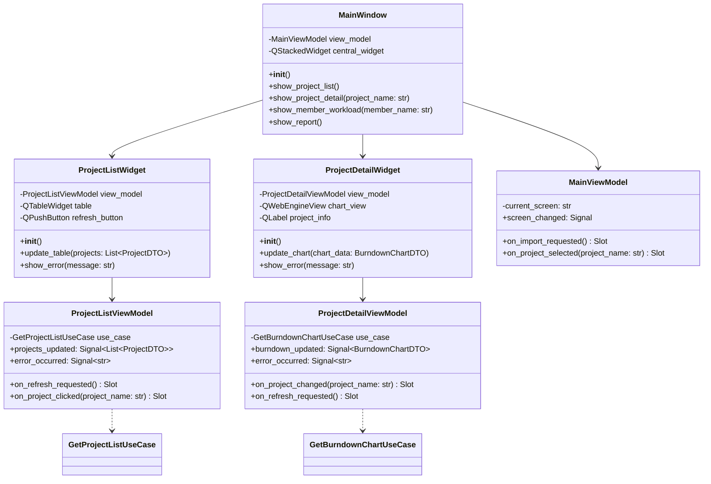
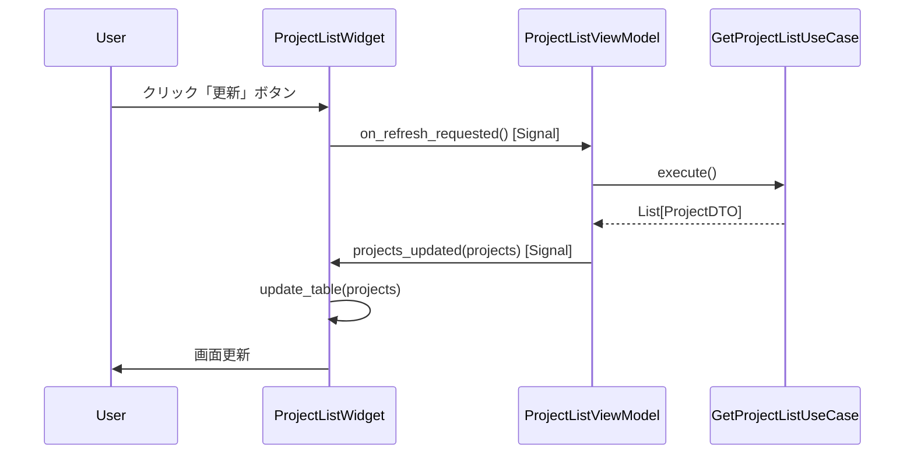
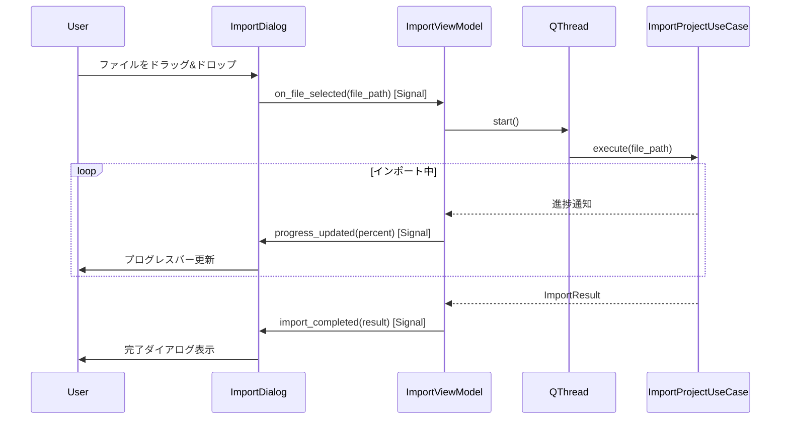

# Presentation Layer Design

## 1. Overview（概要）

本ドキュメントは、Profit Trace の Presentation 層の詳細設計を定義する。Presentation 層は、MVVM（Model-View-ViewModel）パターンに基づき、PySide6 を使用して GUI を実装する。

### 設計対象の目的
- MVVM パターンによる View と ViewModel の分離
- Qt の Signal/Slot メカニズムを活用したデータバインディング
- ユーザー操作（ファイル選択、ドラッグ&ドロップ、画面遷移）の実装

### 関連する REQ-ID
- **機能要件**: REQ-F-004（プロジェクト一覧画面）、REQ-F-005（バーンダウンチャート）、REQ-F-006（個人稼働状況）、REQ-F-009（レポート機能）
- **非機能要件**: REQ-NF-003（操作性）、REQ-NF-008（安定性）

### 関連する ADR
- ADR-001: DDD Lite Monolith アーキテクチャの採用
- ADR-002: MVVM パターンの採用

---

## 2. Architecture Alignment（アーキテクチャ整合性）

### ADR-002 の要点と影響
- Presentation 層に MVVM パターンを適用する
- View は PySide6 の QMainWindow / QWidget / QDialog で実装する
- ViewModel は View ↔ Application 層の仲介を行い、Signal/Slot でデータバインディングを実現する
- View が Signal で ViewModel に UI イベントを通知し、ViewModel が Application 層を呼び出す
- ViewModel が Application 層から取得したデータを Signal で View に通知し、View が Slot で受け取って UI を更新する
- ViewModel はビジネスロジックを持たず、Application 層に委譲する

### 依存方向の制約
- **許可**: Presentation 層 → Application 層（ViewModel がユースケースを呼び出す）
- **禁止**: Presentation 層 → Domain 層（Application 層経由のみ許可）
- **禁止**: Presentation 層 → Infrastructure 層（レイヤー依存ルール違反）
- **禁止**: View → Application 層（ViewModel 経由のみ許可）

### 02_system-requirements との整合性
- View は、REQ-F-004〜REQ-F-006 の画面要件を満たす
- ViewModel は、REQ-NF-003（操作性）の要件を満たすために、エラーダイアログやプログレスバーを表示する
- ドラッグ&ドロップ機能は View で実装し、Signal で ViewModel に通知する

---

## 3. Design Details（詳細設計）

### 3.1 構造（Structure）

#### 画面一覧

| 画面名 | 責務 | View クラス | ViewModel クラス |
|-------|------|------------|-----------------|
| メイン画面 | プロジェクト一覧表示、画面遷移の起点 | MainWindow | MainViewModel |
| プロジェクト一覧画面 | プロジェクトの消化率を一覧表示 | ProjectListWidget | ProjectListViewModel |
| プロジェクト詳細画面 | バーンダウンチャートと詳細情報を表示 | ProjectDetailWidget | ProjectDetailViewModel |
| メンバー稼働状況画面 | メンバー別の稼働状況を表示 | MemberWorkloadWidget | MemberWorkloadViewModel |
| レポート画面 | レポートデータを表示・エクスポート | ReportWidget | ReportViewModel |
| ファイルインポート画面 | CSV/JSON ファイルのインポート | ImportDialog | ImportViewModel |

#### ViewModel 一覧

| ViewModel名 | 責務 | 主要 Signal | 主要 Slot |
|------------|------|------------|----------|
| MainViewModel | メイン画面の状態管理 | screen_changed | on_import_requested, on_project_selected |
| ProjectListViewModel | プロジェクト一覧の状態管理 | projects_updated, error_occurred | on_refresh_requested, on_project_clicked |
| ProjectDetailViewModel | プロジェクト詳細の状態管理 | burndown_updated, error_occurred | on_project_changed, on_refresh_requested |
| MemberWorkloadViewModel | メンバー稼働状況の状態管理 | workload_updated, error_occurred | on_member_changed, on_refresh_requested |
| ReportViewModel | レポートの状態管理 | report_updated, export_completed, error_occurred | on_generate_requested, on_export_requested |
| ImportViewModel | ファイルインポートの状態管理 | import_completed, progress_updated, error_occurred | on_file_selected, on_import_started |

#### クラス構成図



### 3.2 データフロー

#### ファイルインポートのデータフロー
1. **View**: ユーザーがファイルを選択（またはドラッグ&ドロップ）→ Signal 発行（file_selected）
2. **ViewModel**: Slot で Signal を受け取り、ImportUseCase を呼び出す
3. **ViewModel**: QThread でインポート処理を実行（UI をフリーズさせない）
4. **ViewModel**: インポート進捗を Signal で View に通知（progress_updated）
5. **View**: プログレスバーを更新
6. **ViewModel**: インポート完了後、Signal で View に通知（import_completed）
7. **View**: 完了ダイアログを表示

#### バーンダウンチャート表示のデータフロー
1. **View**: ユーザーがプロジェクトを選択 → Signal 発行（project_clicked）
2. **ViewModel**: Slot で Signal を受け取り、GetBurndownChartUseCase を呼び出す
3. **ViewModel**: Application 層から BurndownChartDTO を取得
4. **ViewModel**: BurndownChartDTO を plotly の JSON 形式に変換
5. **ViewModel**: Signal で View に通知（burndown_updated）
6. **View**: Slot で Signal を受け取り、QWebEngineView にチャートを表示

### 3.3 振る舞い（Behavior）

#### ユースケース: プロジェクト一覧の更新



#### ユースケース: ファイルインポート



#### 例外処理方針
- **Application 層からのエラー**: ViewModel が `error_occurred` Signal を発行し、View が Slot でエラーダイアログを表示
- **UI 操作エラー**: View で try-except ブロックを使用し、エラーダイアログを表示
- **ファイル読み込みエラー**: ImportViewModel が `error_occurred` Signal を発行し、ImportDialog がエラーメッセージを表示

#### エラー時の振る舞い
- エラー発生時は、ユーザーに明確なエラーメッセージを表示する（技術的詳細を含めず、問題の内容と対処方法を記述）
- エラー発生後も、アプリケーションは正常に動作し続ける（REQ-NF-008）
- エラーダイアログには「OK」ボタンのみを表示し、ユーザーが確認できるようにする

---

## 4. Mapping to Requirements（要件への対応）

| 設計要素 | 対応する REQ | 説明 |
|---------|--------------|-------|
| ProjectListWidget | REQ-F-004 | プロジェクト一覧画面の表示 |
| ProjectDetailWidget | REQ-F-005 | バーンダウンチャート形式での工数消化可視化 |
| MemberWorkloadWidget | REQ-F-006 | 個人ごとの稼働状況可視化 |
| ReportWidget | REQ-F-009 | レポート機能（グラフと数値） |
| ImportDialog | REQ-F-001, REQ-F-002, REQ-F-003 | CSV/JSON インポート画面 |
| ドラッグ&ドロップ機能 | REQ-NF-003 | 操作性の向上 |
| エラーダイアログ | REQ-NF-003 | エラーメッセージの明確な表示 |
| プログレスバー | REQ-NF-001, REQ-NF-002 | 長時間処理時の UI フリーズ防止 |
| QThread による非同期処理 | REQ-NF-001, REQ-NF-002 | UI フリーズ防止 |

### 未対応の REQ
- **REQ-F-007（工数余剰要因の分析）**: ProjectDetailWidget の拡張として実装予定
- **REQ-F-008（データ再読み込み）**: ImportDialog で実装済み（再インポート機能）

---

## 5. Trade-offs（設計上の判断）

### 判断 1: QWebEngineView によるチャート表示
- **選択肢 A**: QWebEngineView で plotly の HTML を表示する
- **選択肢 B**: Qt のネイティブウィジェット（QChartView）でチャートを描画する
- **採用**: 選択肢 A
- **理由**: plotly は REQ-F-005 で指定されており、インタラクティブなチャート（ズーム、ホバー表示）を簡単に実装できる。QWebEngineView は HTML/JS を表示できるため、plotly との統合が容易である。

### 判断 2: QThread による非同期処理
- **選択肢 A**: QThread でインポート処理を実行する
- **選択肢 B**: Python の asyncio で非同期処理を実装する
- **採用**: 選択肢 A
- **理由**: PySide6 は Qt のイベントループを使用するため、asyncio との統合が複雑になる。QThread は Qt の標準的な非同期処理方式であり、Signal/Slot と自然に統合される。

### 判断 3: Signal/Slot の命名規則
- **選択肢 A**: Signal は `snake_case`、Slot は `on_<event_name>` の命名規則を使用する
- **選択肢 B**: Qt の標準的な命名規則（camelCase）を使用する
- **採用**: 選択肢 A
- **理由**: Python の PEP 8 スタイルガイドに従い、`snake_case` を使用する。Slot は `on_` プレフィックスを付けることで、Signal との対応関係を明確にする。

---

## 6. Risks & Future Considerations（リスクと将来拡張）

### リスク 1: ViewModel の肥大化
- **リスク**: ViewModel に複雑なデータ変換ロジックが混在し、肥大化する可能性がある
- **影響**: ViewModel の保守性が低下し、テストが困難になる
- **軽減策**: ViewModel はデータ変換のみを行い、集計処理は Application 層に委譲する。複雑なデータ変換が必要な場合は、専用のコンバータークラスを作成する。

### リスク 2: QWebEngineView のメモリ消費
- **リスク**: QWebEngineView は Chromium エンジンを使用するため、メモリ消費が大きい
- **影響**: 複数のチャートを同時に表示すると、メモリ不足になる可能性がある
- **軽減策**: チャートは 1 画面に 1 つのみ表示する。複数のチャートを表示する場合は、画面遷移で切り替える。

### リスク 3: Signal/Slot の接続ミス
- **リスク**: Signal/Slot の接続を忘れると、UI イベントが ViewModel に伝わらず、動作しない
- **影響**: UI が反応せず、ユーザーが操作できない
- **軽減策**: Signal/Slot の接続は、ViewModel のコンストラクタで統一的に行う。単体テストで Signal/Slot の発火を検証する。

### 将来の変更時に影響が出る箇所
- **新しい画面の追加**: 新しい Widget と ViewModel を追加し、MainWindow の画面遷移ロジックを修正する必要がある
- **UI デザインの変更**: View のレイアウトを変更する必要があるが、ViewModel は変更不要である（MVVM パターンの利点）
- **チャートライブラリの変更**: plotly から別のライブラリに変更する場合、ViewModel のデータ変換ロジックを修正する必要がある

### ADR を再評価するべきトリガー
- **トリガー 1**: QWebEngineView のメモリ消費が問題になり、ネイティブウィジェット（QChartView）への変更が必要になった場合
- **トリガー 2**: リアルタイム更新の要件が追加され、WebSocket や Qt の Signal/Slot による自動更新が必要になった場合
- **トリガー 3**: ViewModel が肥大化し、Presenter パターンへの変更が必要になった場合

---

## 7. Appendix

### View の詳細仕様

#### ProjectListWidget の詳細仕様
```python
from PySide6.QtWidgets import QWidget, QTableWidget, QVBoxLayout, QPushButton
from PySide6.QtCore import Slot

class ProjectListWidget(QWidget):
    def __init__(self, view_model: ProjectListViewModel):
        super().__init__()
        self.view_model = view_model

        # UI コンポーネント
        self.table = QTableWidget()
        self.refresh_button = QPushButton("更新")

        # レイアウト
        layout = QVBoxLayout()
        layout.addWidget(self.table)
        layout.addWidget(self.refresh_button)
        self.setLayout(layout)

        # Signal/Slot 接続
        self.refresh_button.clicked.connect(self.view_model.on_refresh_requested)
        self.view_model.projects_updated.connect(self.update_table)
        self.view_model.error_occurred.connect(self.show_error)

        # 初期表示
        self.view_model.on_refresh_requested()

    @Slot(list)
    def update_table(self, projects: List[ProjectDTO]):
        """プロジェクト一覧を更新する"""
        self.table.setRowCount(len(projects))
        self.table.setColumnCount(7)
        self.table.setHorizontalHeaderLabels([
            "プロジェクト名", "開始日", "終了日", "契約工数",
            "消化工数", "消化率", "状態"
        ])

        for row, project in enumerate(projects):
            self.table.setItem(row, 0, QTableWidgetItem(project.name))
            self.table.setItem(row, 1, QTableWidgetItem(str(project.start_date)))
            self.table.setItem(row, 2, QTableWidgetItem(str(project.end_date)))
            self.table.setItem(row, 3, QTableWidgetItem(f"{project.contracted_hours:.2f}"))
            self.table.setItem(row, 4, QTableWidgetItem(f"{project.consumed_hours:.2f}"))
            self.table.setItem(row, 5, QTableWidgetItem(f"{project.consumption_rate * 100:.1f}%"))
            self.table.setItem(row, 6, QTableWidgetItem(project.status))

    @Slot(str)
    def show_error(self, message: str):
        """エラーダイアログを表示する"""
        QMessageBox.critical(self, "エラー", message)
```

#### ProjectDetailWidget の詳細仕様
```python
from PySide6.QtWidgets import QWidget, QVBoxLayout, QLabel
from PySide6.QtWebEngineWidgets import QWebEngineView
from PySide6.QtCore import Slot
import plotly.graph_objects as go

class ProjectDetailWidget(QWidget):
    def __init__(self, view_model: ProjectDetailViewModel):
        super().__init__()
        self.view_model = view_model

        # UI コンポーネント
        self.project_info = QLabel()
        self.chart_view = QWebEngineView()

        # レイアウト
        layout = QVBoxLayout()
        layout.addWidget(self.project_info)
        layout.addWidget(self.chart_view)
        self.setLayout(layout)

        # Signal/Slot 接続
        self.view_model.burndown_updated.connect(self.update_chart)
        self.view_model.error_occurred.connect(self.show_error)

    @Slot(object)
    def update_chart(self, chart_data: BurndownChartDTO):
        """バーンダウンチャートを更新する"""
        # プロジェクト情報の表示
        self.project_info.setText(f"プロジェクト: {chart_data.project_name}")

        # plotly でチャートを生成
        fig = go.Figure()

        # 理想線
        ideal_dates = [point.date for point in chart_data.ideal_line]
        ideal_hours = [point.remaining_hours for point in chart_data.ideal_line]
        fig.add_trace(go.Scatter(
            x=ideal_dates,
            y=ideal_hours,
            mode='lines',
            name='理想線'
        ))

        # 実績線
        actual_dates = [point.date for point in chart_data.actual_line]
        actual_hours = [point.remaining_hours for point in chart_data.actual_line]
        fig.add_trace(go.Scatter(
            x=actual_dates,
            y=actual_hours,
            mode='lines+markers',
            name='実績線'
        ))

        # 現在日マーカー
        fig.add_vline(
            x=chart_data.current_date_marker,
            line_dash="dash",
            annotation_text="現在"
        )

        fig.update_layout(
            title="バーンダウンチャート",
            xaxis_title="日付",
            yaxis_title="残工数（時間）"
        )

        # HTML に変換して QWebEngineView に表示
        html = fig.to_html()
        self.chart_view.setHtml(html)

    @Slot(str)
    def show_error(self, message: str):
        """エラーダイアログを表示する"""
        QMessageBox.critical(self, "エラー", message)
```

### ViewModel の詳細仕様

#### ProjectListViewModel の詳細仕様
```python
from PySide6.QtCore import QObject, Signal, Slot

class ProjectListViewModel(QObject):
    # Signal
    projects_updated = Signal(list)  # List[ProjectDTO]
    error_occurred = Signal(str)

    def __init__(self, use_case: GetProjectListUseCase):
        super().__init__()
        self.use_case = use_case

    @Slot()
    def on_refresh_requested(self):
        """プロジェクト一覧の更新を要求"""
        try:
            projects = self.use_case.execute()
            self.projects_updated.emit(projects)
        except Exception as e:
            self.error_occurred.emit(f"プロジェクト一覧の取得に失敗しました: {e}")

    @Slot(str)
    def on_project_clicked(self, project_name: str):
        """プロジェクトがクリックされた時の処理"""
        # MainViewModel に画面遷移を通知
        # （実装は MainViewModel で行う）
        pass
```

#### ImportViewModel の詳細仕様
```python
from PySide6.QtCore import QObject, Signal, Slot, QThread

class ImportWorker(QObject):
    """インポート処理を行うワーカースレッド"""
    progress_updated = Signal(int)
    import_completed = Signal(object)  # ImportResult

    def __init__(self, use_case, file_path):
        super().__init__()
        self.use_case = use_case
        self.file_path = file_path

    def run(self):
        """インポート処理を実行"""
        result = self.use_case.execute(self.file_path)
        self.import_completed.emit(result)

class ImportViewModel(QObject):
    # Signal
    import_completed = Signal(object)  # ImportResult
    progress_updated = Signal(int)
    error_occurred = Signal(str)

    def __init__(self, import_project_use_case: ImportProjectUseCase):
        super().__init__()
        self.import_project_use_case = import_project_use_case

    @Slot(str)
    def on_file_selected(self, file_path: str):
        """ファイルが選択された時の処理"""
        # QThread でインポート処理を実行
        self.thread = QThread()
        self.worker = ImportWorker(self.import_project_use_case, file_path)
        self.worker.moveToThread(self.thread)

        # Signal/Slot 接続
        self.thread.started.connect(self.worker.run)
        self.worker.import_completed.connect(self.on_import_completed)
        self.worker.progress_updated.connect(self.progress_updated)

        # スレッド開始
        self.thread.start()

    @Slot(object)
    def on_import_completed(self, result):
        """インポート完了時の処理"""
        self.thread.quit()
        self.thread.wait()

        if result.success:
            self.import_completed.emit(result)
        else:
            self.error_occurred.emit("\n".join(result.errors))
```

### Signal/Slot の命名規則

#### Signal の命名規則
- `<動作>_<過去分詞>` 形式を使用する（例: `projects_updated`, `error_occurred`）
- データを伴う Signal は、型ヒントでデータ型を明示する（例: `projects_updated = Signal(list)`）

#### Slot の命名規則
- `on_<イベント名>` 形式を使用する（例: `on_refresh_requested`, `on_project_clicked`）
- Slot のパラメータは、Signal から渡されるデータと一致させる

### メモ・補足
- Presentation 層の実装は、MVVM パターンに基づき、View と ViewModel を分離する
- View は UI の表示のみを担当し、ビジネスロジックは持たない
- ViewModel は Application 層のユースケースを呼び出し、取得したデータを Signal で View に通知する
- QThread を使用することで、長時間処理時に UI がフリーズしないようにする
