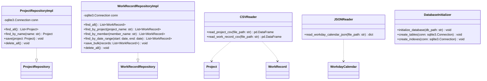
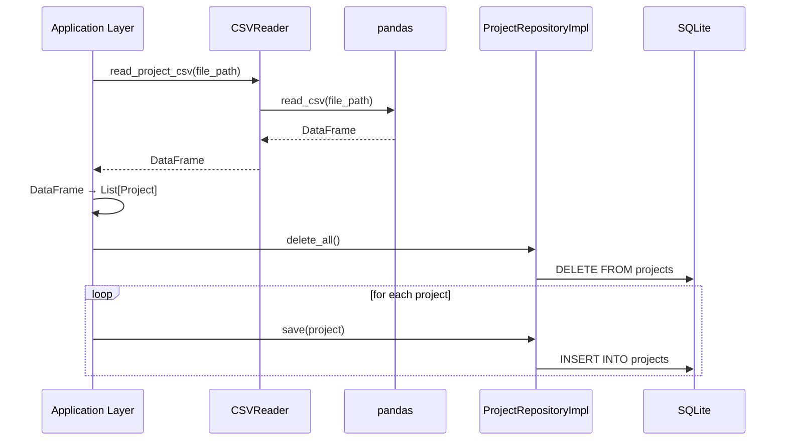
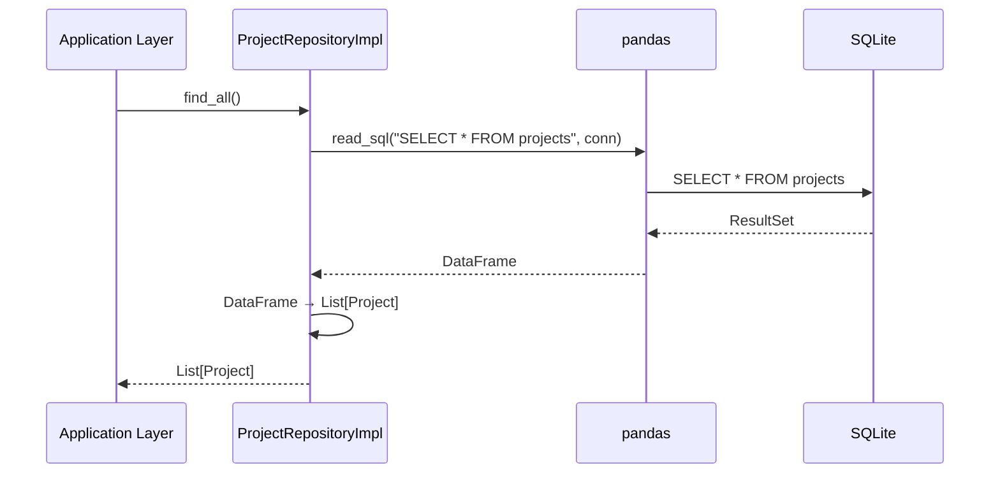

# Infrastructure Layer Design

## 1. Overview（概要）

本ドキュメントは、Profit Trace の Infrastructure 層の詳細設計を定義する。Infrastructure 層は、Repository パターンの実装、CSV/JSON ファイルの I/O、SQLite データベースアクセス、ログ出力を担当する。

### 設計対象の目的
- Repository インターフェースの実装（ProjectRepositoryImpl, WorkRecordRepositoryImpl 等）
- CSV/JSON ファイルの読み込み・バリデーション
- SQLite データベースのスキーマ設計とアクセス
- ログ出力の実装

### 関連する REQ-ID
- **機能要件**: REQ-F-001〜REQ-F-003（CSV/JSON インポート）、REQ-F-008（データ再読み込み）
- **非機能要件**: REQ-NF-001（パフォーマンス）、REQ-NF-005（ログ記録）、REQ-NF-006（バックアップ）、REQ-NF-007（セキュリティ）

### 関連する ADR
- ADR-001: DDD Lite Monolith アーキテクチャの採用
- ADR-003: SQLite キャッシュ方式によるデータストア戦略
- ADR-004: Repository パターンによる層間依存性管理

---

## 2. Architecture Alignment（アーキテクチャ整合性）

### ADR-003 の要点と影響
- 外部 CSV / JSON ファイルを Single Source of Truth（マスタデータ）とする
- SQLite は「表示・集計のためのキャッシュ」として機能させる
- データフロー: 外部ファイル → アプリ（インポート処理・バリデーション）→ SQLite → アプリ（集計・グラフ生成）→ UI
- 日次で CSV / JSON を再取り込みし、SQLite を上書き更新する
- データの整合性は CSV データで上書きすることで保証する

### ADR-004 の要点と影響
- Repository インターフェースを Domain 層で定義し、Infrastructure 層で実装する
- Application 層は Repository インターフェース経由でのみデータにアクセスする
- 依存性逆転の原則を適用し、Domain 層は Infrastructure 層に依存しない
- Repository の実装は ORM を使用せず、生 SQL または pandas.read_sql で実装する

### 依存方向の制約
- **許可**: Infrastructure 層 → Domain 層（エンティティの使用、Repository インターフェースの実装）
- **禁止**: Infrastructure 層 → Application 層（レイヤー依存ルール違反）
- **禁止**: Infrastructure 層 → Presentation 層（レイヤー依存ルール違反）

### 02_system-requirements との整合性
- CSV/JSON のフォーマットは、REQ-F-001〜REQ-F-003 の仕様に従う
- SQLite のパフォーマンスは、REQ-NF-001（データ読み込み時間: 5〜10 秒）を満たす
- ログ出力は、REQ-NF-005（エラーログの記録）の仕様に従う
- データはローカル PC 上のみで管理し、外部サーバーへの送信は行わない（REQ-NF-007）

---

## 3. Design Details（詳細設計）

### 3.1 構造（Structure）

#### Repository 実装一覧

| Repository実装名 | 責務 | 主要メソッド |
|----------------|------|------------|
| ProjectRepositoryImpl | Project エンティティの SQLite 永続化 | find_all(), find_by_name(name), save(project), delete_all() |
| WorkRecordRepositoryImpl | WorkRecord エンティティの SQLite 永続化 | find_all(), find_by_project(project_name), find_by_member(member_name), find_by_date_range(start, end), save_bulk(records), delete_all() |
| WorkdayCalendarRepositoryImpl | WorkdayCalendar エンティティの SQLite 永続化 | find_all(), find_by_year_month(year_month), is_workday(date), save_bulk(calendars), delete_all() |
| MemberRepositoryImpl | Member エンティティの SQLite 永続化 | find_all(), find_by_name(name), save(member), delete_all() |

#### ファイル I/O クラス一覧

| クラス名 | 責務 | 主要メソッド |
|---------|------|------------|
| CSVReader | CSV ファイルの読み込み | read_project_csv(file_path), read_work_record_csv(file_path) |
| JSONReader | JSON ファイルの読み込み | read_workday_calendar_json(file_path) |
| CSVWriter | CSV ファイルの書き込み（エクスポート） | write_project_csv(file_path, projects), write_work_record_csv(file_path, records) |
| JSONWriter | JSON ファイルの書き込み（エクスポート） | write_workday_calendar_json(file_path, calendars) |

#### SQLite スキーマ

```sql
-- プロジェクトテーブル
CREATE TABLE projects (
    project_id TEXT PRIMARY KEY,
    name TEXT NOT NULL UNIQUE,
    start_date TEXT NOT NULL,
    end_date TEXT NOT NULL,
    contracted_hours REAL NOT NULL
);

-- 工数実績テーブル
CREATE TABLE work_records (
    record_id TEXT PRIMARY KEY,
    date TEXT NOT NULL,
    hours REAL NOT NULL,
    member_name TEXT NOT NULL,
    project_name TEXT NOT NULL,
    memo TEXT,
    FOREIGN KEY (project_name) REFERENCES projects(name)
);

-- 営業日カレンダーテーブル
CREATE TABLE workday_calendars (
    year_month TEXT NOT NULL,
    day INTEGER NOT NULL,
    is_workday INTEGER NOT NULL,
    PRIMARY KEY (year_month, day)
);

-- メンバーテーブル
CREATE TABLE members (
    member_name TEXT PRIMARY KEY
);

-- インデックス（パフォーマンス最適化）
CREATE INDEX idx_work_records_project ON work_records(project_name);
CREATE INDEX idx_work_records_member ON work_records(member_name);
CREATE INDEX idx_work_records_date ON work_records(date);
```

#### クラス構成図



### 3.2 データフロー

#### CSV インポートのデータフロー
1. **Application 層**: ImportProjectUseCase が CSVReader.read_project_csv(file_path) を呼び出す
2. **Infrastructure 層**: CSVReader が pandas.read_csv() で CSV を読み込み、DataFrame を返す
3. **Application 層**: DataFrame を Project エンティティのリストに変換
4. **Application 層**: ProjectRepository.delete_all() を呼び出し、既存データを削除
5. **Infrastructure 層**: ProjectRepositoryImpl が SQLite の DELETE 文を実行
6. **Application 層**: ProjectRepository.save(project) を各プロジェクトに対して呼び出す
7. **Infrastructure 層**: ProjectRepositoryImpl が SQLite の INSERT 文を実行

#### SQLite データ取得のデータフロー
1. **Application 層**: GetProjectListUseCase が ProjectRepository.find_all() を呼び出す
2. **Infrastructure 層**: ProjectRepositoryImpl が SQLite の SELECT 文を実行
3. **Infrastructure 層**: pandas.read_sql() で DataFrame を取得
4. **Infrastructure 層**: DataFrame を Project エンティティのリストに変換
5. **Infrastructure 層**: Project エンティティのリストを Application 層に返す

### 3.3 振る舞い（Behavior）

#### ユースケース: プロジェクト契約情報の CSV インポート



#### ユースケース: プロジェクト一覧の取得



#### 例外処理方針
- **ファイル読み込みエラー**: CSV/JSON ファイルが存在しない、または読み込めない場合は `FileNotFoundError` を発生させる
- **SQLite エラー**: SQLite の接続・クエリ実行エラーが発生した場合は `sqlite3.Error` をキャッチし、ログに記録して再 raise する
- **データ変換エラー**: DataFrame からエンティティへの変換時にエラーが発生した場合は `ValueError` を発生させる

#### エラー時の振る舞い
- Infrastructure 層で発生した例外は、ログに記録して上位層に伝播させる
- SQLite の接続エラーが発生した場合は、アプリケーションを終了せず、エラーメッセージを返す
- ファイル I/O エラーが発生した場合は、エラー内容を明確に記録し、ユーザーに通知する

---

## 4. Mapping to Requirements（要件への対応）

| 設計要素 | 対応する REQ | 説明 |
|---------|--------------|-------|
| CSVReader | REQ-F-001, REQ-F-002 | プロジェクト契約情報・工数実績データの CSV 読み込み |
| JSONReader | REQ-F-003 | 休日マスタの JSON 読み込み |
| ProjectRepositoryImpl | REQ-F-001, REQ-F-008 | プロジェクト契約情報のインポート・再読み込み |
| WorkRecordRepositoryImpl | REQ-F-002, REQ-F-008 | 工数実績データのインポート・再読み込み |
| WorkdayCalendarRepositoryImpl | REQ-F-003, REQ-F-008 | 休日マスタのインポート・再読み込み |
| CSVWriter | REQ-NF-006 | データバックアップ（CSV エクスポート） |
| JSONWriter | REQ-NF-006 | データバックアップ（JSON エクスポート） |
| SQLite インデックス | REQ-NF-001 | データ読み込み時間の最適化 |
| logging モジュール | REQ-NF-005 | エラーログの記録 |
| ローカル実行 | REQ-NF-007 | データの機密性（外部サーバーへの送信なし） |

### 未対応の REQ
- **REQ-F-004〜REQ-F-007（画面表示機能）**: Application 層および Presentation 層で実装
- **REQ-NF-002（チャート描画時間）**: Application 層および Presentation 層で実装

---

## 5. Trade-offs（設計上の判断）

### 判断 1: ORM を使用しない（生 SQL + pandas）
- **選択肢 A**: ORM（SQLAlchemy 等）を使用する
- **選択肢 B**: 生 SQL と pandas.read_sql を使用する
- **採用**: 選択肢 B
- **理由**: ADR-004 の方針に従い、小規模データ（プロジェクト 50 件、工数実績 5000 件）では ORM の学習コストと実行時オーバーヘッドが不要である。pandas.read_sql は DataFrame への変換が容易で、集計処理との親和性が高い。

### 判断 2: SQLite の接続プーリング不要
- **選択肢 A**: 接続プーリングを実装する
- **選択肢 B**: 接続プーリングを実装しない
- **採用**: 選択肢 B
- **理由**: 本プロジェクトはデスクトップアプリであり、単独実行されるため、接続プーリングは不要である。接続は Application 起動時に 1 回のみ確立し、終了時にクローズする。

### 判断 3: CSV/JSON フォーマットのバリデーションを Application 層で実装
- **選択肢 A**: Infrastructure 層で CSV/JSON フォーマットのバリデーションを実装する
- **選択肢 B**: Application 層で CSV/JSON フォーマットのバリデーションを実装する
- **採用**: 選択肢 B
- **理由**: Infrastructure 層は CSV/JSON の読み込みのみを担当し、バリデーションは Application 層で実装する。これにより、Infrastructure 層を薄く保ち、Application 層でビジネスルールに基づくバリデーションを行う。

---

## 6. Risks & Future Considerations（リスクと将来拡張）

### リスク 1: SQLite のパフォーマンス低下
- **リスク**: 大規模データ（プロジェクト数 1000 件以上、工数実績 10 万件以上）では SQLite のパフォーマンスが低下する可能性がある
- **影響**: データ読み込み時間が REQ-NF-001 の基準（5〜10 秒）を超える
- **軽減策**: インデックスを適切に設定し、クエリを最適化する。将来的にデータ量が増加した場合は、PostgreSQL / MySQL への移行を検討する。

### リスク 2: CSV/JSON ファイルの破損・削除
- **リスク**: CSV/JSON ファイルを誤って削除・上書きした場合、データが失われる
- **影響**: データ復旧が困難になる
- **軽減策**: ユーザーに定期的なバックアップを推奨し、エクスポート機能を提供する（REQ-NF-006）。SQLite からのエクスポート機能により、CSV/JSON を再生成できる。

### リスク 3: SQLite ファイルの破損
- **リスク**: SQLite ファイルが破損した場合、データが読み込めなくなる
- **影響**: アプリケーションが起動しない、またはデータが表示されない
- **軽減策**: CSV/JSON からの再インポート機能により、SQLite を再生成できる。SQLite ファイルの定期的なバックアップを推奨する。

### 将来の変更時に影響が出る箇所
- **データストアの変更（SQLite → PostgreSQL）**: Repository 実装を変更するだけで対応可能。Repository インターフェースは変更不要。
- **CSV/JSON フォーマットの変更**: CSVReader / JSONReader の実装を変更する必要がある。Application 層への影響は最小限に抑えられる。
- **外部 API 連携**: 新しい Repository 実装を追加し、Application 層で使用する Repository を切り替える。

### ADR を再評価するべきトリガー
- **トリガー 1**: 大規模データにより SQLite のパフォーマンスが問題になった場合
- **トリガー 2**: マルチユーザー・マルチテナント化により、PostgreSQL / MySQL への移行が必要になった場合
- **トリガー 3**: リアルタイム更新の要件が追加され、イベント駆動アーキテクチャの導入が必要になった場合

---

## 7. Appendix

### Repository 実装の詳細仕様

#### ProjectRepositoryImpl の詳細仕様
```python
import sqlite3
import pandas as pd
from typing import List, Optional
from domain.entities import Project
from domain.repositories import ProjectRepository

class ProjectRepositoryImpl(ProjectRepository):
    def __init__(self, db_path: str):
        self.db_path = db_path
        self.conn = sqlite3.connect(db_path)

    def find_all(self) -> List[Project]:
        """全プロジェクトを取得する"""
        query = "SELECT * FROM projects"
        df = pd.read_sql(query, self.conn)

        projects = []
        for _, row in df.iterrows():
            project = Project(
                project_id=row['project_id'],
                name=row['name'],
                start_date=pd.to_datetime(row['start_date']).date(),
                end_date=pd.to_datetime(row['end_date']).date(),
                contracted_hours=row['contracted_hours']
            )
            projects.append(project)

        return projects

    def find_by_name(self, name: str) -> Optional[Project]:
        """プロジェクト名で検索する"""
        query = "SELECT * FROM projects WHERE name = ?"
        df = pd.read_sql(query, self.conn, params=(name,))

        if df.empty:
            return None

        row = df.iloc[0]
        return Project(
            project_id=row['project_id'],
            name=row['name'],
            start_date=pd.to_datetime(row['start_date']).date(),
            end_date=pd.to_datetime(row['end_date']).date(),
            contracted_hours=row['contracted_hours']
        )

    def save(self, project: Project) -> None:
        """プロジェクトを保存する"""
        query = """
        INSERT OR REPLACE INTO projects (project_id, name, start_date, end_date, contracted_hours)
        VALUES (?, ?, ?, ?, ?)
        """
        cursor = self.conn.cursor()
        cursor.execute(query, (
            project.project_id,
            project.name,
            project.start_date.isoformat(),
            project.end_date.isoformat(),
            project.contracted_hours
        ))
        self.conn.commit()

    def delete_all(self) -> None:
        """全プロジェクトを削除する（再インポート時に使用）"""
        query = "DELETE FROM projects"
        cursor = self.conn.cursor()
        cursor.execute(query)
        self.conn.commit()

    def close(self):
        """データベース接続をクローズする"""
        self.conn.close()
```

#### WorkRecordRepositoryImpl の詳細仕様
```python
class WorkRecordRepositoryImpl(WorkRecordRepository):
    def __init__(self, db_path: str):
        self.db_path = db_path
        self.conn = sqlite3.connect(db_path)

    def find_all(self) -> List[WorkRecord]:
        """全工数実績を取得する"""
        query = "SELECT * FROM work_records"
        df = pd.read_sql(query, self.conn)
        return self._dataframe_to_entities(df)

    def find_by_project(self, project_name: str) -> List[WorkRecord]:
        """プロジェクト名で工数実績を検索する"""
        query = "SELECT * FROM work_records WHERE project_name = ?"
        df = pd.read_sql(query, self.conn, params=(project_name,))
        return self._dataframe_to_entities(df)

    def find_by_member(self, member_name: str) -> List[WorkRecord]:
        """メンバー名で工数実績を検索する"""
        query = "SELECT * FROM work_records WHERE member_name = ?"
        df = pd.read_sql(query, self.conn, params=(member_name,))
        return self._dataframe_to_entities(df)

    def find_by_date_range(self, start: date, end: date) -> List[WorkRecord]:
        """日付範囲で工数実績を検索する"""
        query = "SELECT * FROM work_records WHERE date BETWEEN ? AND ?"
        df = pd.read_sql(query, self.conn, params=(start.isoformat(), end.isoformat()))
        return self._dataframe_to_entities(df)

    def save_bulk(self, records: List[WorkRecord]) -> None:
        """工数実績を一括保存する（パフォーマンス最適化）"""
        data = [
            (
                record.record_id,
                record.date.isoformat(),
                record.hours,
                record.member_name,
                record.project_name,
                record.memo
            )
            for record in records
        ]

        query = """
        INSERT OR REPLACE INTO work_records (record_id, date, hours, member_name, project_name, memo)
        VALUES (?, ?, ?, ?, ?, ?)
        """
        cursor = self.conn.cursor()
        cursor.executemany(query, data)
        self.conn.commit()

    def delete_all(self) -> None:
        """全工数実績を削除する（再インポート時に使用）"""
        query = "DELETE FROM work_records"
        cursor = self.conn.cursor()
        cursor.execute(query)
        self.conn.commit()

    def _dataframe_to_entities(self, df: pd.DataFrame) -> List[WorkRecord]:
        """DataFrame を WorkRecord エンティティのリストに変換する"""
        records = []
        for _, row in df.iterrows():
            record = WorkRecord(
                record_id=row['record_id'],
                date=pd.to_datetime(row['date']).date(),
                hours=row['hours'],
                member_name=row['member_name'],
                project_name=row['project_name'],
                memo=row['memo']
            )
            records.append(record)
        return records

    def close(self):
        """データベース接続をクローズする"""
        self.conn.close()
```

### ファイル I/O の詳細仕様

#### CSVReader の詳細仕様
```python
import pandas as pd

class CSVReader:
    @staticmethod
    def read_project_csv(file_path: str) -> pd.DataFrame:
        """プロジェクト契約情報の CSV を読み込む

        Args:
            file_path: CSV ファイルパス

        Returns:
            DataFrame: プロジェクト契約情報

        Raises:
            FileNotFoundError: ファイルが見つからない場合
        """
        df = pd.read_csv(file_path, encoding='utf-8')
        return df

    @staticmethod
    def read_work_record_csv(file_path: str) -> pd.DataFrame:
        """工数実績データの CSV を読み込む

        Args:
            file_path: CSV ファイルパス

        Returns:
            DataFrame: 工数実績データ

        Raises:
            FileNotFoundError: ファイルが見つからない場合
        """
        df = pd.read_csv(file_path, encoding='utf-8')
        return df
```

#### JSONReader の詳細仕様
```python
import json

class JSONReader:
    @staticmethod
    def read_workday_calendar_json(file_path: str) -> dict:
        """休日マスタの JSON を読み込む

        Args:
            file_path: JSON ファイルパス

        Returns:
            dict: 休日マスタデータ

        Raises:
            FileNotFoundError: ファイルが見つからない場合
        """
        with open(file_path, 'r', encoding='utf-8') as f:
            data = json.load(f)
        return data
```

### データベース初期化の詳細仕様

#### DatabaseInitializer の詳細仕様
```python
import sqlite3

class DatabaseInitializer:
    @staticmethod
    def initialize_database(db_path: str) -> None:
        """データベースを初期化する（テーブルとインデックスを作成）"""
        conn = sqlite3.connect(db_path)
        DatabaseInitializer.create_tables(conn)
        DatabaseInitializer.create_indexes(conn)
        conn.close()

    @staticmethod
    def create_tables(conn: sqlite3.Connection) -> None:
        """テーブルを作成する"""
        cursor = conn.cursor()

        # プロジェクトテーブル
        cursor.execute("""
        CREATE TABLE IF NOT EXISTS projects (
            project_id TEXT PRIMARY KEY,
            name TEXT NOT NULL UNIQUE,
            start_date TEXT NOT NULL,
            end_date TEXT NOT NULL,
            contracted_hours REAL NOT NULL
        )
        """)

        # 工数実績テーブル
        cursor.execute("""
        CREATE TABLE IF NOT EXISTS work_records (
            record_id TEXT PRIMARY KEY,
            date TEXT NOT NULL,
            hours REAL NOT NULL,
            member_name TEXT NOT NULL,
            project_name TEXT NOT NULL,
            memo TEXT,
            FOREIGN KEY (project_name) REFERENCES projects(name)
        )
        """)

        # 営業日カレンダーテーブル
        cursor.execute("""
        CREATE TABLE IF NOT EXISTS workday_calendars (
            year_month TEXT NOT NULL,
            day INTEGER NOT NULL,
            is_workday INTEGER NOT NULL,
            PRIMARY KEY (year_month, day)
        )
        """)

        # メンバーテーブル
        cursor.execute("""
        CREATE TABLE IF NOT EXISTS members (
            member_name TEXT PRIMARY KEY
        )
        """)

        conn.commit()

    @staticmethod
    def create_indexes(conn: sqlite3.Connection) -> None:
        """インデックスを作成する（パフォーマンス最適化）"""
        cursor = conn.cursor()

        # 工数実績テーブルのインデックス
        cursor.execute("""
        CREATE INDEX IF NOT EXISTS idx_work_records_project
        ON work_records(project_name)
        """)

        cursor.execute("""
        CREATE INDEX IF NOT EXISTS idx_work_records_member
        ON work_records(member_name)
        """)

        cursor.execute("""
        CREATE INDEX IF NOT EXISTS idx_work_records_date
        ON work_records(date)
        """)

        conn.commit()
```

### ログ出力の詳細仕様

#### ログ設定
```python
import logging
import os

def setup_logging(log_dir: str = "logs"):
    """ログ出力の設定を行う

    Args:
        log_dir: ログファイルの保存ディレクトリ
    """
    # ログディレクトリの作成
    os.makedirs(log_dir, exist_ok=True)

    # ログファイルパス
    log_file = os.path.join(log_dir, "profit_trace.log")

    # ログ設定
    logging.basicConfig(
        level=logging.INFO,
        format='%(asctime)s - %(name)s - %(levelname)s - %(message)s',
        handlers=[
            logging.FileHandler(log_file, encoding='utf-8'),
            logging.StreamHandler()
        ]
    )

    # ロガーの取得
    logger = logging.getLogger(__name__)
    logger.info("Logging initialized")
```

### メモ・補足
- Infrastructure 層の実装は、Repository パターンに基づき、Domain 層の Repository インターフェースを実装する
- SQLite の接続は Application 起動時に 1 回のみ確立し、終了時にクローズする
- pandas.read_sql を使用することで、SQLite から DataFrame への変換が容易になる
- CSV/JSON のフォーマットバリデーションは Application 層で実装し、Infrastructure 層は読み込みのみを担当する
- ログ出力は、logging モジュールを使用して統一的に実装する
